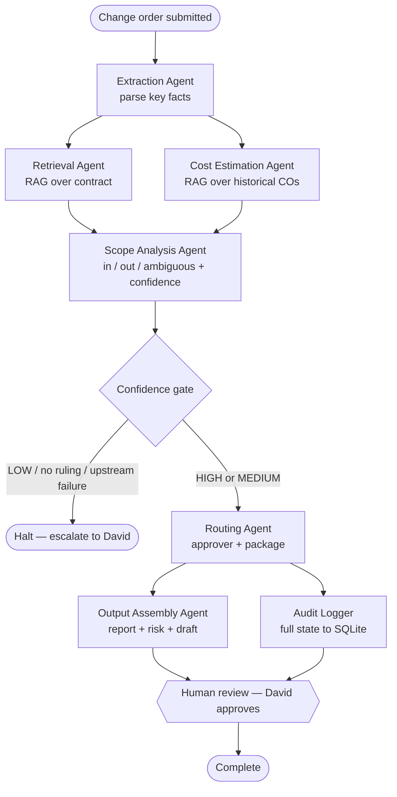
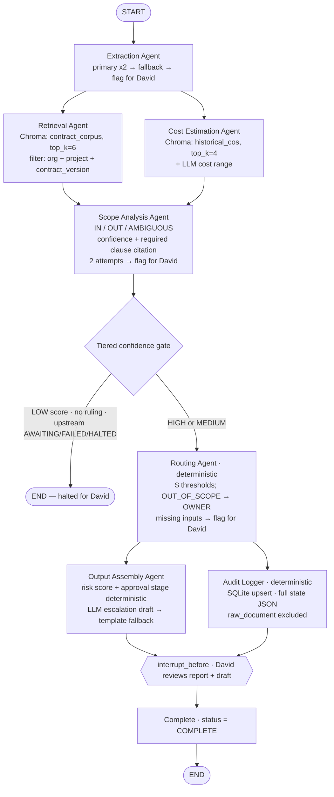

# Change Order Management Agent

A multi-agent pipeline that triages construction **change orders** end to end: it extracts
the key facts from a submitted document, checks the work against the project contract and
against historical cost data, rules on whether the work is in or out of scope, scores risk,
routes the order to the right approver, and writes a full audit record — then **pauses for a
human to review before anything is finalized**.

Built for the person who owns change orders on a large construction project (a project
manager handling a high volume of orders), where a single wrong or untraceable decision can
turn into a cost dispute.

> Modeled on a large hospital-construction scenario. The sample contract and historical
> data under `tests/data/` are illustrative, not real project data.

---

## Architecture

The system is an **orchestrated state machine** (a supervisor-style pattern) built on
**LangGraph**. A single typed state object (`ChangeOrderState`) is passed between nodes.
No agent calls another agent directly — the graph wiring controls all sequencing, the one
branch point is a confidence gate, and a human-in-the-loop interrupt fires before completion.



### Components

| Node | Type | Responsibility |
|---|---|---|
| **Extraction Agent** | LLM | Parses the redacted change order into structured facts (work type, subcontractor, dollar amount, description). Primary prompt → reduced fallback prompt → flag for human. |
| **Retrieval Agent** | RAG | Embeds the extracted facts and retrieves relevant contract sections from ChromaDB, filtered to the order's org / project / contract version. |
| **Cost Estimation Agent** | RAG + LLM | Retrieves comparable historical change orders, then estimates a fair cost range. |
| **Scope Analysis Agent** | LLM | Rules `IN_SCOPE` / `OUT_OF_SCOPE` / `AMBIGUOUS` with a confidence score and a **required contract-clause citation**. Applies a narrow-exclusion rule so an exclusion is never expanded beyond its literal text. |
| **Routing Agent** | Deterministic | Picks the approver from dollar thresholds (out-of-scope always routes to the owner) and maps work type to a department. No LLM. |
| **Output Assembly Agent** | Deterministic + LLM | Computes a risk score and approval stage (deterministic), then drafts an escalation email (LLM, with a template fallback). The draft is held for review — never auto-sent. |
| **Audit Logger** | Deterministic | Writes the full state snapshot to SQLite (idempotent upsert keyed on change-order id). No LLM. |

### Detailed flow

This mirrors the real graph wiring in [`graph/graph.py`](change_order_agent/graph/graph.py).
The **only** conditional branch is the confidence gate after scope analysis. Internal
fallbacks (extraction fallback, scope retries, the escalation template fallback) live
*inside* nodes and surface as pipeline state — a node that "flags for David" sets the
pipeline status, which the gate then halts on.



**Parallel execution windows** — two fan-out / fan-in windows run independent work concurrently:

- **Window 1:** Retrieval + Cost Estimation, after extraction.
- **Window 2:** Output Assembly + Audit Logging, after routing.

**Confidence gate (tiered).** Scope confidence is bucketed in the state schema:
`HIGH ≥ 0.75`, `MEDIUM 0.45–0.74`, `LOW < 0.45`. The gate halts the pipeline on a LOW score,
a missing ruling, or any upstream failure; HIGH/MEDIUM proceed (MEDIUM is flagged in the report).

**Human-in-the-loop.** The graph is compiled with `interrupt_before=["complete"]` and a
SQLite checkpointer keyed by change-order id, so the pipeline pauses before completion,
survives a restart, and resumes only after David approves.

---

## Tech stack

- **Orchestration:** LangGraph (state graph, conditional edge, parallel nodes, interrupt, checkpointing)
- **LLM:** OpenAI `gpt-4o-mini` via the `openai` SDK, `temperature=0`, with `response_format` structured (Pydantic) parsing
- **Embeddings / vector store:** OpenAI `text-embedding-3-small` + ChromaDB (persistent, metadata-filtered)
- **State & validation:** Pydantic v2 models with enums and validators
- **Persistence:** SQLite — audit log (`audit.db`) and LangGraph checkpoints (`checkpoints.db`)
- **Tracing:** LangSmith (optional)
- **Tests:** pytest

---

## Project structure

```
change_order_agent/
├── state/
│   └── change_order_state.py    # Single typed state: enums, per-agent output sections, validators
├── agents/
│   ├── extraction_agent.py      # Task 1 — extract facts (LLM, primary → fallback → flag)
│   ├── retrieval_agent.py       # Task 2 — contract RAG
│   ├── cost_estimation_agent.py # Task 4 — historical RAG + cost range
│   ├── scope_analysis_agent.py  # Task 3 — scope ruling + confidence + clause
│   ├── routing_agent.py         # Tasks 5/6 — deterministic approver routing + package
│   └── output_assembly_agent.py # Task 8 — risk score, report, escalation draft
├── utils/
│   ├── retrieval_utils.py       # ChromaDB collection + retrieval helper
│   ├── audit_logger.py          # Task 7 — SQLite audit trail
│   ├── seed_contract_store.py   # One-time contract indexing
│   └── seed_historical_store.py # One-time historical CO indexing
└── graph/
    ├── graph.py                 # Graph wiring, confidence gate, interrupt, completion node
    └── run.py                   # Entry points: run, approve/resume, query state, reject/halt
tests/
├── test_smoke.py                # 18 tests — no network: schema, gate, routing, risk, graph compile
├── test_e2e.py                  # 2 tests — full pipeline (requires a live OPENAI_API_KEY)
└── data/                        # Sample contract + historical COs (illustrative)
```

---

## Setup

```bash
pip install -r requirements.txt
cp .env.example .env          # add your real OPENAI_API_KEY

# Seed the vector stores (one-time)
python -m change_order_agent.utils.seed_contract_store \
    --file tests/data/sample_contract.txt \
    --org-id ORG-TEST --project-id PROJ-MISSION-BAY --contract-version v1.0
python -m change_order_agent.utils.seed_historical_store \
    --file tests/data/sample_historical_cos.json \
    --org-id ORG-TEST --project-id PROJ-MISSION-BAY
```

## Running

```bash
# Smoke tests — no API calls, no tokens spent
python -m pytest tests/test_smoke.py -q

# End-to-end — runs a real change order through the pipeline (needs a live OPENAI_API_KEY)
python -m pytest tests/test_e2e.py -v -s
```

Programmatic use:

```python
from change_order_agent.graph.run import process_change_order, approve_and_complete

paused = process_change_order(state)   # runs to the human-review pause
# ... David reviews paused.assembly.full_report and paused.assembly.escalation_draft ...
final = approve_and_complete(state.input.co_id)
```

---

## Security & privacy

- **PII separation.** The input schema stores `raw_document` and `redacted_document`
  separately. Agents only ever process the redacted version, and the audit log explicitly
  excludes `raw_document` from the stored snapshot.
- **Tenant isolation.** Every retrieval is filtered by `org_id` / `project_id` /
  `contract_version`, so an order can only see its own contract data.
- **No secrets in the repo.** Real keys live in `.env` (gitignored); only `.env.example`
  with placeholders is committed.

## License

Copyright (c) 2026 Bramara Manjeera Thogarcheti. **All Rights Reserved.** See [LICENSE](LICENSE).
This repository is published for demonstration only; no reuse is permitted without written permission.
